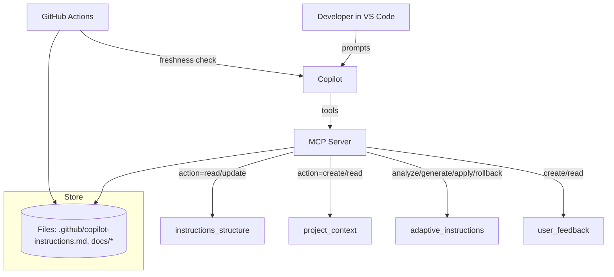

# アーキテクチャ概要

作成日: 2025-12-01

```mermaid
flowchart TD
  U[Developer in VS Code] -->|prompts| C[Copilot]
  C -->|tools| MCP[MCP Server]
  MCP -->|action=read/update| AST[instructions_structure]
  MCP -->|action=create/read| PC[project_context]
  MCP -->|analyze/generate/apply/rollback| AI[adaptive_instructions]
  MCP -->|create/read| UF[user_feedback]
  subgraph Store
    FS[(Files: .github/copilot-instructions.md, docs/*)]
  end
  MCP --> FS
  CI[GitHub Actions] --> FS
  CI -->|freshness check| C
```

## キーデザイン原則
- ツール数最小化、CRUDは`action`で切替
- Copilot主体で指示書を読み、差分を検知・更新
- 安全性: 機密排除、ローカル優先、ロールバック可
