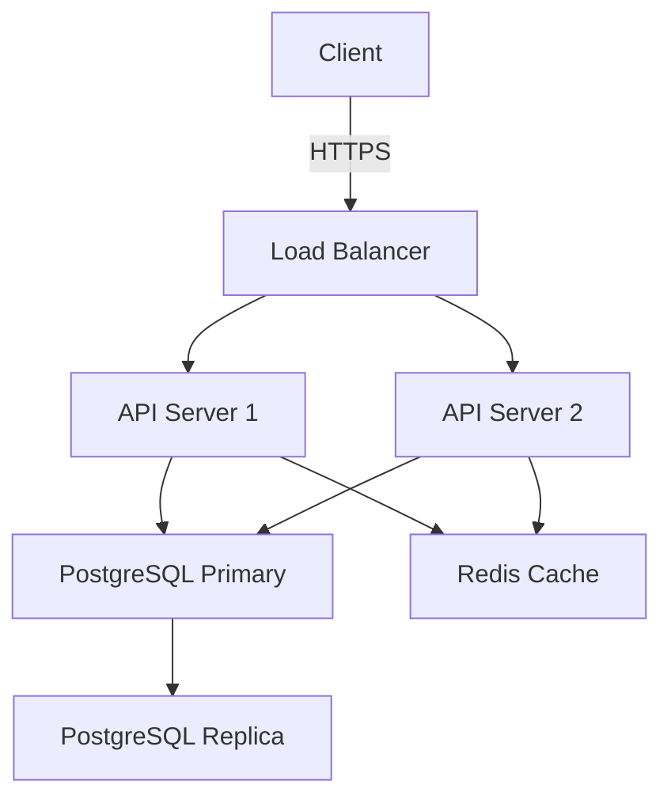

# Documentation Phase Guidance

## Documentation Phase Overview

The documentation phase focuses on creating and maintaining comprehensive documentation for your codebase, APIs, and project. Good documentation improves onboarding, reduces support burden, and serves as a reference for current and future developers.

### When to Write Documentation:
- After implementing new features or APIs
- Before releasing to production
- When onboarding new team members
- During refactoring (update existing docs)
- In response to support questions (expand FAQ)

### Types of Documentation:
1. **Code Documentation**: Inline comments, JSDoc, type definitions
2. **API Documentation**: Endpoint descriptions, request/response examples
3. **User Documentation**: Guides, tutorials, FAQs
4. **Project Documentation**: README, contributing guidelines, architecture docs
5. **Process Documentation**: Deployment procedures, runbooks, troubleshooting guides

## README Structure Best Practices

A well-structured README is the entry point to your project:

### Essential Sections:
```markdown
# Project Name

Brief description (1-2 sentences) explaining what the project does.

## Features

- Key feature 1
- Key feature 2
- Key feature 3

## Installation

```bash
npm install your-package
```

## Quick Start

```typescript
import { YourLibrary } from 'your-package';

const instance = new YourLibrary();
instance.doSomething();
```

## Usage

### Basic Example
Detailed example with explanation.

### Advanced Example
More complex use case.

## API Reference

Link to full API documentation or provide overview here.

## Configuration

Explain configuration options, environment variables.

## Contributing

Link to CONTRIBUTING.md or provide guidelines.

## License

MIT License - see LICENSE file for details.
```

### Optional Sections (add as needed):
- **Prerequisites**: System requirements, dependencies
- **Troubleshooting**: Common issues and solutions
- **Roadmap**: Planned features and improvements
- **Changelog**: Link to CHANGELOG.md
- **Acknowledgments**: Credits and attributions
- **Badges**: Build status, coverage, version, license

### README Anti-Patterns:
- ❌ Outdated installation instructions
- ❌ Broken example code
- ❌ Missing prerequisites
- ❌ No contact information or links to issues
- ❌ Too long (move details to separate docs)

## API Documentation Generation

### JSDoc for TypeScript/JavaScript
Document functions, classes, and types inline:

```typescript
/**
 * Calculate the total price including tax.
 * 
 * @param basePrice - The price before tax in dollars
 * @param taxRate - The tax rate as a decimal (e.g., 0.08 for 8%)
 * @returns The total price including tax, rounded to 2 decimal places
 * 
 * @throws {Error} If basePrice is negative
 * @throws {Error} If taxRate is not between 0 and 1
 * 
 * @example
 * ```typescript
 * const total = calculateTotal(100, 0.08);
 * console.log(total); // 108.00
 * ```
 */
export function calculateTotal(basePrice: number, taxRate: number): number {
  if (basePrice < 0) {
    throw new Error('basePrice cannot be negative');
  }
  if (taxRate < 0 || taxRate > 1) {
    throw new Error('taxRate must be between 0 and 1');
  }
  return Math.round((basePrice + basePrice * taxRate) * 100) / 100;
}
```

### JSDoc Tags Reference:
- `@param` / `@returns`: Parameter and return value descriptions
- `@throws`: Exceptions that can be thrown
- `@example`: Usage examples
- `@deprecated`: Mark deprecated APIs
- `@see`: Reference related items
- `@since`: Version when added
- `@internal`: Mark as internal (not public API)

### Generate HTML Documentation:
```bash
# Using TypeDoc
npm install --save-dev typedoc
npx typedoc --out docs src/

# Using JSDoc
npm install --save-dev jsdoc
npx jsdoc -c jsdoc.json
```

### API Documentation Tools:
- **TypeDoc**: TypeScript-native documentation generator
- **JSDoc**: JavaScript documentation generator
- **API Extractor**: Microsoft tool for API documentation
- **Compodoc**: Angular-specific documentation tool

## REST API Documentation

### OpenAPI (Swagger) Specification:
```yaml
openapi: 3.0.0
info:
  title: User API
  version: 1.0.0
  description: API for managing users

paths:
  /users:
    get:
      summary: List all users
      parameters:
        - name: page
          in: query
          schema:
            type: integer
            default: 1
        - name: limit
          in: query
          schema:
            type: integer
            default: 20
      responses:
        '200':
          description: Successful response
          content:
            application/json:
              schema:
                type: object
                properties:
                  data:
                    type: array
                    items:
                      $ref: '#/components/schemas/User'
                  pagination:
                    $ref: '#/components/schemas/Pagination'

    post:
      summary: Create a new user
      requestBody:
        required: true
        content:
          application/json:
            schema:
              $ref: '#/components/schemas/UserInput'
      responses:
        '201':
          description: User created
          content:
            application/json:
              schema:
                $ref: '#/components/schemas/User'
        '400':
          description: Invalid input

components:
  schemas:
    User:
      type: object
      properties:
        id:
          type: string
          format: uuid
        email:
          type: string
          format: email
        name:
          type: string
        createdAt:
          type: string
          format: date-time
```

### Generate API Docs from Code:
```typescript
// Using tsoa (TypeScript + OpenAPI)
import { Controller, Get, Post, Route, Body, Query } from 'tsoa';

@Route('users')
export class UsersController extends Controller {
  /**
   * Retrieve a list of users
   * @param page Page number (default: 1)
   * @param limit Items per page (default: 20)
   */
  @Get()
  public async getUsers(
    @Query() page = 1,
    @Query() limit = 20
  ): Promise<UserListResponse> {
    // Implementation
  }

  /**
   * Create a new user
   * @param requestBody User data
   */
  @Post()
  public async createUser(
    @Body() requestBody: UserInput
  ): Promise<User> {
    // Implementation
  }
}
```

### API Documentation Tools:
- **Swagger UI**: Interactive API documentation
- **Redoc**: OpenAPI documentation renderer
- **Stoplight**: API design and documentation platform
- **Postman**: API testing with auto-generated documentation

## Inline Documentation Standards

### When to Write Comments:

**DO Comment**:
- Complex algorithms or business logic
- Non-obvious workarounds or hacks
- Public APIs and exported functions
- Important architectural decisions
- TODO items with context

**DON'T Comment**:
- Obvious code that's self-explanatory
- Redundant information already in function name
- Commented-out code (use git history instead)

### Good Comment Examples:
```typescript
// ✅ Explains WHY, not WHAT
// Use exponential backoff to avoid overwhelming the API during high load
async function retryWithBackoff(fn: () => Promise<any>, maxRetries = 3) {
  // ...
}

// ✅ Documents edge case handling
function parseDate(input: string): Date {
  // Handle ISO 8601 format with timezone offset (e.g., "2025-12-02T10:30:00+09:00")
  // Some older browsers don't parse this correctly, so we normalize it first
  const normalized = input.replace(/([+-]\d{2}):(\d{2})$/, '$1$2');
  return new Date(normalized);
}

// ✅ TODO with context
// TODO(username): Refactor this to use the new caching layer once PR #234 is merged
function fetchUserData(id: string) {
  // ...
}
```

### Bad Comment Examples:
```typescript
// ❌ Obvious comment
// Increment counter by 1
counter++;

// ❌ Redundant comment
// Get user by ID
function getUserById(id: string) { }

// ❌ Outdated comment (code changed but comment didn't)
// Returns user email
function getUserProfile(id: string): UserProfile { } // Now returns full profile
```

### Code Annotations:
```typescript
// TODO: Task to be done
// FIXME: Known bug that needs fixing
// HACK: Temporary workaround
// NOTE: Important information
// OPTIMIZE: Performance improvement opportunity
// DEPRECATED: Mark as deprecated with migration path
```

## Architecture Documentation

### Architecture Decision Records (ADRs):
Document important architectural decisions:

```markdown
# ADR 001: Use PostgreSQL for Primary Database

## Status
Accepted

## Context
We need a relational database for our application. Key requirements:
- ACID transactions
- JSON support for flexible schemas
- Strong community and tooling support
- Scalability for 10M+ records

## Decision
We will use PostgreSQL as our primary database.

## Consequences

### Positive:
- Mature, battle-tested database
- Excellent JSON/JSONB support
- Strong TypeScript ecosystem (TypeORM, Prisma)
- Easy to run locally and in containers

### Negative:
- Vertical scaling limitations (addressed by read replicas)
- More complex than NoSQL for certain use cases
- Requires more upfront schema design

## Alternatives Considered
- MongoDB: Too flexible, harder to maintain consistency
- MySQL: Less robust JSON support
- DynamoDB: Vendor lock-in, complex query patterns
```

### System Architecture Diagrams:
Use tools like:
- **Mermaid**: Text-based diagrams in markdown
- **PlantUML**: UML diagrams from text
- **Draw.io**: Visual diagramming tool
- **Excalidraw**: Hand-drawn style diagrams



## Documentation Maintenance

### Keep Documentation Up-to-Date:
- Update docs in the same PR as code changes
- Review docs during code review
- Schedule regular documentation audits
- Use automation to detect outdated examples

### Documentation Checklist (PR Review):
- [ ] README updated if public API changed
- [ ] JSDoc comments added/updated for new functions
- [ ] API documentation reflects endpoint changes
- [ ] Examples are tested and working
- [ ] Breaking changes documented in CHANGELOG
- [ ] Migration guide provided for breaking changes

### Automated Documentation Checks:
```typescript
// Test that code examples in docs actually work
describe('Documentation Examples', () => {
  it('README quick start example should work', () => {
    // Copy-paste example from README
    const instance = new YourLibrary();
    const result = instance.doSomething();
    expect(result).toBeDefined();
  });
});
```

## Documentation for Different Audiences

### For Developers (Internal):
- Code architecture and design patterns
- Development setup and tooling
- Testing strategies
- Deployment procedures
- Troubleshooting guides

### For API Consumers (External):
- Authentication and authorization
- Endpoint reference with examples
- Rate limiting and quotas
- Error codes and handling
- SDKs and client libraries

### For End Users:
- Feature guides and tutorials
- FAQ and troubleshooting
- Video walkthroughs (if applicable)
- Best practices and tips

## Documentation Tools and Platforms

### Static Site Generators:
- **VitePress**: Modern, fast, Vue-based
- **Docusaurus**: React-based, feature-rich
- **MkDocs**: Python-based, simple
- **GitBook**: Hosted solution with editor

### Documentation Hosting:
- **GitHub Pages**: Free, integrated with repos
- **Vercel/Netlify**: Auto-deploy from git
- **Read the Docs**: Python project documentation
- **GitBook**: Commercial documentation platform

### Collaborative Documentation:
- **Notion**: Team wikis and knowledge base
- **Confluence**: Enterprise documentation
- **Markdown in Git**: Version-controlled docs

## Writing Style Guidelines

### Technical Writing Best Practices:
- **Be concise**: Remove unnecessary words
- **Use active voice**: "The function returns" not "The result is returned by"
- **Be specific**: Provide concrete examples
- **Use consistent terminology**: Don't alternate between "user" and "account"
- **Structure with headings**: Make docs scannable
- **Provide context**: Explain WHY, not just HOW

### Code Example Guidelines:
- Include imports and setup
- Show expected output
- Cover common use cases first
- Provide error handling examples
- Keep examples self-contained

```typescript
// ❌ Bad: Missing context
calculateTotal(100, 0.08);

// ✅ Good: Complete example
import { calculateTotal } from './pricing';

const basePrice = 100;
const taxRate = 0.08;
const total = calculateTotal(basePrice, taxRate);
console.log(`Total: $${total}`); // Total: $108.00
```

## Quality Gates for Documentation Phase

Before completing documentation phase:
- [ ] README is up-to-date and accurate
- [ ] All public APIs have JSDoc comments
- [ ] API documentation generated and deployed
- [ ] Code examples tested and working
- [ ] Breaking changes documented with migration guide
- [ ] Architecture diagrams updated if needed
- [ ] Changelog updated with version notes
- [ ] Documentation reviewed by another team member
- [ ] Links checked (no 404s)
- [ ] Spelling and grammar checked

## Summary

Good documentation is essential for project success. Write documentation continuously as you code, not as an afterthought. Keep it accurate, concise, and targeted to your audience. Use automation to maintain quality and consistency over time.

→ See `phases/development.md` for JSDoc examples during development.
→ See `conventions/git-workflow.md` for changelog and commit documentation practices.
→ See `architecture/api-design.md` for API documentation patterns.
